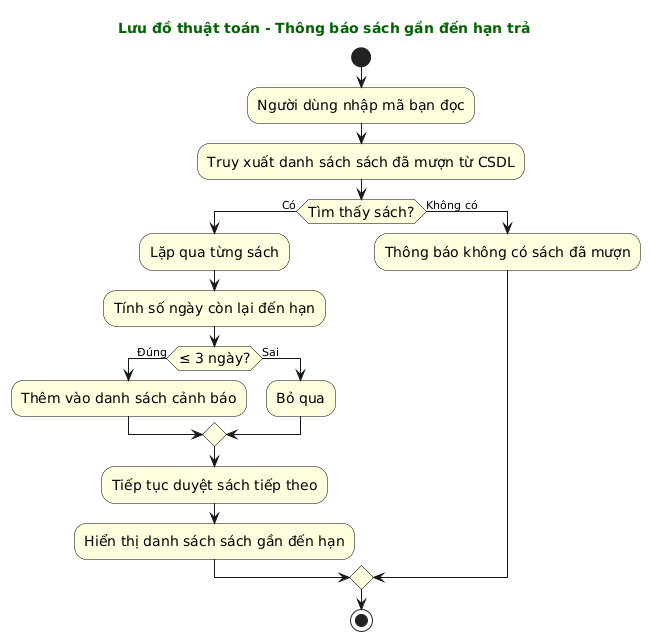

# Group14_OOP_N02_term3_2025 

## Thành Viên:
Lê Xuân Hoàng, Nguyễn Tiến Hoàng Vũ, Nguyễn Anh Quân

## Tiêu Đề :

Quản lý thư viện sách

## ReadMe giới thiệu project:
Link: [https://github.com/hoag-le/Group14_OOP_N02_term3_2025](https://github.com/hoag-le/Group14_OOP_N02_term3_2025/tree/main/ReadMe)

## Cách chạy ứng dụng
- Vào `springBoot14/complete`.
- Sử dụng `./mvnw spring-boot:run` (hoặc `./gradlew bootRun`) để khởi động ứng dụng Spring Boot.

## Cấu hình Database
Ứng dụng sử dụng cơ sở dữ liệu Aiven nên cần khai báo các biến môi trường trước khi chạy:

```bash
export AIVEN_JDBC_URL=<jdbc-url>
export AIVEN_DB_USER=<username>
export AIVEN_DB_PASSWORD=<password>
```

Nếu muốn đơn giản, bạn có thể tạo file `springBoot14/complete/src/main/resources/application.properties` và điền trực tiếp các thông tin kết nối:

```
spring.datasource.url=<jdbc-url>
spring.datasource.username=<username>
spring.datasource.password=<password>
```

## Giới thiệu cấu trúc dự án
- Thư mục `springBoot14/complete/src/main/java` chứa mã nguồn Spring Boot gồm các lớp như `Book`, `Member`, `Library`, `LibraryManager`, `BorrowRecord`, `BorrowTicket*`. `Library` quản lý dữ liệu trong bộ nhớ/file trong khi `LibraryManager` làm việc với cơ sở dữ liệu.
- Thư mục `src/repository` chứa lớp `CrudRepository`.
- Thư mục `test/models` chứa các test JUnit.

## Đối Tượng:
- Sách (Book)
- Thành viên (Member)
- Thư viện (Library)  
=======


**Xây dựng ứng dụng Quản lý Thư viện Sách.**
-   **Giao diện:** Java Spring Boot.
-   **Có chức năng quản lý Sách (Book):**
    +   Thêm, sửa, xóa thông tin Sách.
    +   Liệt kê thông tin về Sách, có thể lọc ra các Sách theo Tên sách, Tác giả, Thể loại, Mã ISBN, Nhà xuất bản, Năm xuất bản,...
-   **Có chức năng quản lý Thành viên (Member):**
    +   Thêm, sửa, xóa thông tin Thành viên.
    +   Liệt kê thông tin về Thành viên, có thể lọc ra các Thành viên theo Tên, Mã thành viên, ...
-   **Có chức năng quản lý việc Mượn/Trả Sách:**
    +   Cho phép Thành viên mượn Sách (tạo Phiếu Mượn).
    +   Ghi nhận việc Thành viên trả Sách (cập nhật Phiếu Mượn).
    +   Liệt kê các Sách đang được mượn, Sách đã trả, Sách quá hạn (nếu có).
    +   Tính phí trễ hạn khi trả sách dựa trên `BorrowRecord`.
    +   Cảnh báo sách sắp đến hạn trả thông qua `BorrowTicketUtils`.
-   **Dữ liệu được lưu trữ xuống file nhị phân:**
    +   Cần tạo các lớp liên quan đến **Sách (Book)**, **Thành viên (Member)**, và **Phiếu Mượn/Trả (BorrowingRecord/Loan)** để đọc, ghi dữ liệu xuống một hay nhiều file nhị phân. Lớp `Library` sẽ quản lý việc này.
-   **Khi làm việc với dữ liệu trong bộ nhớ:** Dữ liệu cần được lưu trữ dưới dạng các Collection tùy chọn như `ArrayList`, `LinkedList`, `HashMap`, `HashSet`, ... để quản lý danh sách Sách, Thành viên, và các giao dịch mượn/trả.
-   **Mở rộng (Tùy chọn):** Sinh viên có thể thêm các chức năng vào chương trình để ứng dụng phong phú hơn bằng cách thêm các nghiệp vụ cho bài toán (ví dụ: tìm kiếm nâng cao, thống kê báo cáo, quản lý đặt trước sách, thông báo quá hạn, phân quyền người dùng,...).

### Sơ đồ Lớp (Class Diagram)
**Dự kiến các lớp chính:**
*   `Book`: Lưu trữ thông tin sách (mã sách, tên sách, tác giả, nhà xuất bản, năm XB, thể loại, số lượng, ISBN,...).
*   `Member`: Lưu trữ thông tin thành viên (mã thành viên, họ tên, ngày sinh, địa chỉ, SĐT,...).
*   `BorrowingRecord` (hoặc `Loan`): Lưu trữ thông tin mượn trả (mã phiếu, mã thành viên, mã sách, ngày mượn, ngày hẹn trả, ngày trả thực tế, trạng thái).
*   `Library`: Lớp quản lý chính, chứa danh sách các `Book`, `Member`, `BorrowingRecord`; cung cấp các phương thức nghiệp vụ (thêm/sửa/xóa sách/thành viên, cho mượn, nhận trả, tìm kiếm, lưu/tải dữ liệu).
*   `Author` (Tùy chọn): Nếu muốn quản lý thông tin tác giả chi tiết.
*   `Category` (Tùy chọn): Nếu muốn quản lý thông tin thể loại chi tiết.
*   `DataManager` (Tùy chọn): Lớp chuyên trách việc đọc/ghi dữ liệu từ file nhị phân.


### Sơ đồ Hành vi (Behavioural Diagrams)


### CRUD
1. Sách (Book)
create_book(): Thêm sách mới

* get_books(): Lấy danh sách sách

* update_book(book_id): Cập nhật thông tin sách

* delete_book(book_id): Xóa sách

2. Thành viên (Member)
create_member()

* get_members()

* update_member(member_id)

* delete_member(member_id)

3. Thư viện (Library)
create_library()

* get_libraries()

* update_library(library_id)

* delete_library(library_id)

### Lưu đồ thuật toán 

 

### Phương thức 
 
**1. Phương thức: Kiểm tra sách gần đến hạn trả (Nguyễn Tiến Hoàng Vũ)**

- Miêu tả phương thức:

* Tên phương thức: kiemTraSachGanDenHanTra

* Mục đích: Kiểm tra xem phiếu mượn có nằm trong khoảng thời gian gần đến hạn trả hay không.

* Tham số đầu vào:

* ticket: Đối tượng BorrowTicket

* soNgayCanhBao: số nguyên – khoảng cảnh báo (ví dụ: 3 ngày)

* Giá trị trả về: true nếu ngày trả nằm trong khoảng từ hiện tại đến (hiện tại + soNgayCanhBao), ngược lại false. 

**2. Phương thức: In thông báo đến bạn đọc sách gần hết hạn (Nguyễn Anh Quân)**  

- Miêu tả phương thức:

* Tên phương thức: inThongBaoSachGanHetHan

* Mục đích: In thông báo cho bạn đọc có sách sắp đến hạn trả.

* Tham số đầu vào:

* danhSachBorrowTicket: Danh sách các BorrowTicket

* soNgayCanhBao: số nguyên – khoảng cảnh báo (ví dụ: 3 ngày)

* Giá trị trả về: Không trả về (void). In ra thông tin bạn đọc nếu phiếu mượn gần đến hạn trả (dựa vào phương thức kiemTraSachGanDenHanTra).

**3. Phương thức: In danh sách được mượn bởi bạn đọc (Lê Xuân Hoàng)** 

- Miêu tả phương thức:

* Tên phương thức: inDanhSachSachDuocMuon

* Mục đích: In danh sách các sách đang được mượn bởi một bạn đọc cụ thể.

* Tham số đầu vào:

* danhSachBorrowTicket: Danh sách các BorrowTicket

* maBanDoc: Mã số của bạn đọc cần tra cứu

* Giá trị trả về: Không trả về (void). In ra danh sách tên sách mà bạn đọc có mã maBanDoc đang mượn.
